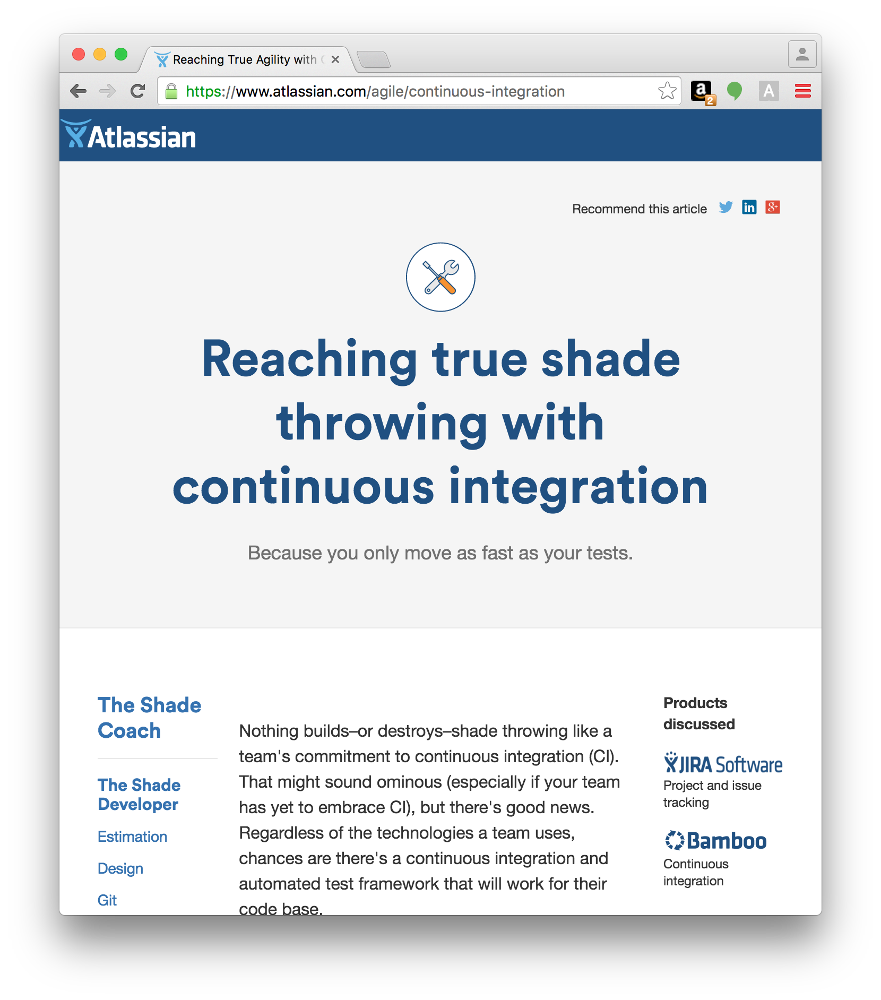

agile-to-shade
=============

Chrome extension that replaces occurrences of "agile" with "my shade", and "agility" with "shade throwing."

[Direct download of crx file](https://github.com/jcsalterego/agile-to-shade/raw/master/AgileToShade.crx)

Installation
------------

In Chrome, choose Window > Extensions.  Drag AgileToShade.crx into the page that appears.

With Apologies
--------------

To [https://github.com/panicsteve/cloud-to-butt](https://github.com/panicsteve/cloud-to-butt)

Because
-------

[https://twitter.com/skamille/status/770406125040697344](https://twitter.com/skamille/status/770406125040697344)

Screenshot
----------

